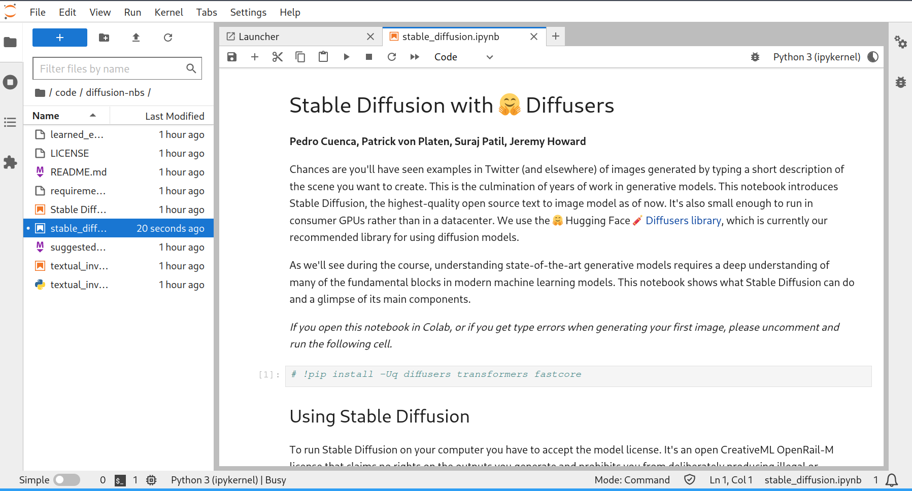

# FastAI's Diffusion Notebooks

This directory contains scripts for running [fastai/diffusion-nbs](https://github.com/fastai/diffusion-nbs).

This document is meant to be tutorial explaining how to use the [`jupyter-lab`](../jupyter-lab/README.md) base image to run jupyter notebooks.

## Basic Usage

1. Run `./init.sh`.
2. Run `./run.sh`.

## Tutorial: Running Jupyter Notebooks

Here's a common scenario. You've found a jupyter notebook on the internet, and you want to run it.

In this case, we'll look at [FastAI's Diffusion Notebooks](https://github.com/fastai/diffusion-nbs). Let's follow the steps described in [`apps/jupyter-lab/README.md`](../jupyter-lab/README.md) to get it running.

### Step 1: Determining dependencies

The repo contains a `requirements.txt` file, which is a [`pip` requirements file](https://pip.pypa.io/en/stable/reference/requirements-file-format/). That means the python dependencies will be very simple.

After looking around a bit, there don't seem to be any system-level dependencies. So it looks like we won't need to `apt install` any packages.

### Step 2: Create an environment with the dependencies installed.

Let's create three files:

- A `Dockerfile.fastai-diffusion-nbs` to define a new docker image.
- An `init.sh` script to do setup.
- A `run.sh` script to start and restart our container.

Here is our `Dockerfile.fastai-diffusion-nbs`:

```dockerfile
FROM jupyter-lab-base
COPY code/diffusion-nbs/requirements.txt requirements.txt
RUN pip install -r requirements.txt
```

The Dockerfile can conveniently use `jupyter-lab-base` as our starting point.

Here is our `init.sh`:

```sh
#!/bin/bash
mkdir -p code
pushd code
git clone https://github.com/fastai/diffusion-nbs
popd

mkdir -p setup
cp ../jupyter-lab/setup/run-jupyter-lab.sh setup/

docker build \
    -f Dockerfile.fastai-diffusion-nbs \
    -t fastai-diffusion-nbs \
    .
```

This `init.sh` will clone the repo into `code/diffusion-nbs`, copy a setup script from `jupyter-lab`, and build the docker image.

Here is our `run.sh`:

```sh
#!/bin/bash
echo "Stopping fastai-diffusion-nbs if it is running."
docker stop fastai-diffusion-nbs || true
sleep 1

docker network create osai-bridge || true

echo
read -sp "Enter password for Jupyter Lab: " JUPYTER_PASSWORD
echo
echo "Running fastai-diffusion-nbs."
docker run \
    --rm \
    --gpus all \
    -d \
    -it \
    --name fastai-diffusion-nbs \
    --network osai-bridge \
    --publish 7003:7003 \
    --mount type=bind,source="$(pwd)"/code,target=/home/"$USER"/code \
    --mount type=bind,source="$(pwd)"/setup,target=/setup \
    fastai-diffusion-nbs \
    /setup/run-jupyter-lab.sh "$JUPYTER_PASSWORD" 7003
```

The `run.sh` script has a bit more going on, but should look familiar. It is almost an exact copy of [`jupyter-lab/run.sh`](../jupyter-lab/run.sh).

The only things that changed were:

- `--name jupyter-lab` became `--name fastai-diffusion-nbs`
- `--publish 7002:7002` became `--publish 7003:7003` because we'd like a unique port
- We run our newly built`fastai-diffusion-nbs` image, rather than `jupyter-lab-base`.

### Step 3. Run Jupyter Lab and load the notebook.

Now everything should be ready.

We mark `init.sh` and `run.sh` as executable with `chmod +x init.sh run.sh`.

We run `./init.sh` and then `./run.sh`.

We can now view the notebook running in Jupyter Lab in our browser:



### (Optional) Additional steps

#### Configuring Hugging Face Cache

The notebooks download large models from hugging face, and it would be nice not to have to redownload them every time. We can mount a shared cache by adding this line to our `run.sh` file:

```sh
    --mount type=bind,source=/home/$USER/.cache/huggingface,target=/home/$USER/.cache/huggingface \
```

#### Adding a .gitignore

We don't to track unnecessary files, so we add a `.gitignore`:

```
code/
setup/
```

#### Setting up our service on a subdomain

The [`apps/nginx`](../apps/nginx/README.md) service is a convenient way to expose the OSAI apps on subdomains. To add fastai-diffusion-nbs to our list of subdomains, we add this blob to [`conf.d/default.conf`](../apps/nginx/conf.d/default.conf):

```
        if ($subdomain = 'fastai-diffusion-nbs') {
            proxy_pass http://fastai-diffusion-nbs:7003;
        }
```

And we add a service to the list in `mock.sh`:

```sh
service_ports["fastai-diffusion-nbs"]="7003"
```
